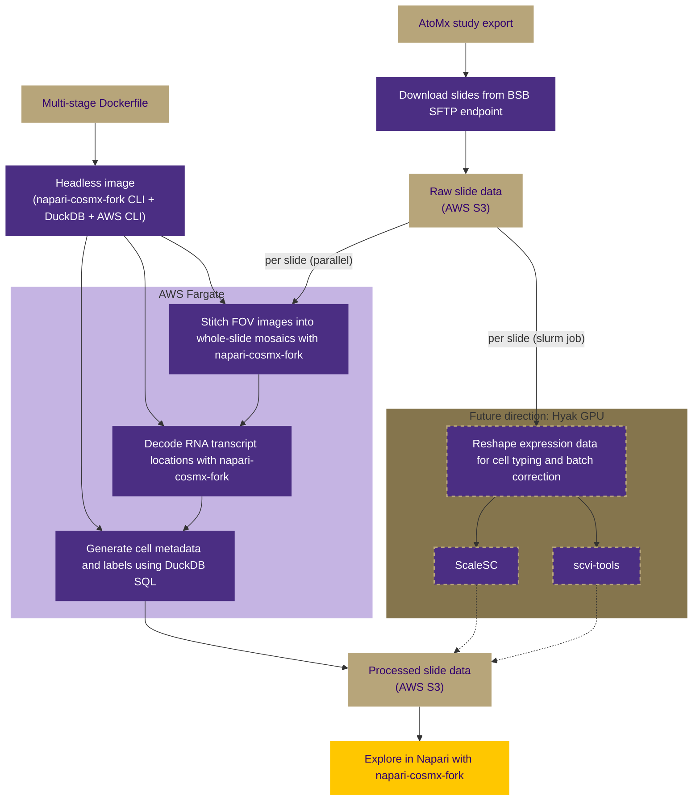

# cosmx-utilities

A scalable, end-to-end pipeline for processing [CosMx Spatial Molecular Imager](https://brukerspatialbiology.com/products/cosmx-spatial-molecular-imager/single-cell-imaging-overview/) data from the [BRaIN Lab](https://dlmp.uw.edu/research-labs/brainlab) at the University of Washington. 

This pipeline automates the workflow for converting raw CosMx slide exports to interactive spatial visualization in [Napari](https://napari.org), using AWS cloud infrastructure for on-demand, cost-effective compute and a fork of [napari-cosmx](https://nanostring-biostats.github.io/CosMx-Analysis-Scratch-Space/posts/napari-cosmx-intro/) for headless image processing and data exploration.

## Pipeline overview

After exporting a study from the AtoMx Spatial Informatics Platform, raw slide data is staged on AWS S3. Each slide is processed in parallel on AWS Fargate: FOV images are stitched into whole-slide mosaics, RNA transcript locations are decoded, and cell metadata is generated, all formatted for viewing in Napari. Processed data is uploaded back to S3, where it can be loaded into Napari for visualization across slides.



## Key design decisions

**Ephemeral Fargate compute** — Using Fargate's ephemeral storage rather than manually provisioning EC2 instances and EBS volumes for each study avoids the accumulation of long-lived AWS resources that are common with ad hoc processing workflows and costly to maintain.

**DuckDB for metadata streaming** — Cell metadata is streamed from S3 with DuckDB SQL queries and transformed into Napari metadata layers, enabling interactive overlay of cell annotations without storing large metadata files locally.

## Repository structure

```
cosmx-utilities/
├── napari-cosmx-fork/       # Fork of napari-cosmx with optional GUI dependencies
├── scripts/
│   ├── process-slide.py     # Single slide: detect segmentation version, download, stitch, upload
│   ├── process-slides.py    # Discover all slides in S3 and launch Fargate tasks
│   └── generate-slide-metadata.py  # Generate _metadata.csv with cell metadata and deterministic colors
├── fargate/                 # Fargate task definitions and IAM configuration
├── Dockerfile               # Multi-stage: headless (Fargate) and GUI (desktop) targets
└── pyproject.toml           # uv workspace with optional [gui] extra
```

## Quick start

### Local development

```bash
# Install CLI tools (no GUI required)
uv sync
uv run stitch-images --help
uv run read-targets --help

# Install with Napari GUI for interactive visualization
uv sync --extra gui
uv run napari /path/to/processed-output
```

### Processing slides on Fargate

Discover all slides under an S3 experiment directory and launch one Fargate task per slide:

```bash
# Preview what would be launched
uv run python scripts/process-slides.py s3://bucket/project/study/ --whatif

# Launch Fargate tasks (one per slide, parallel)
uv run python scripts/process-slides.py s3://bucket/project/study/

# Skip already processed slides
uv run python scripts/process-slides.py s3://bucket/project/study/ --skip
```

Each Fargate task runs `process-slide.py`, which:
1. Queries segmentation manifests in S3 via DuckDB to find the correct segmentation version
2. Downloads only the needed CellLabels, morphology images, and AnalysisResults
3. Stitches FOV images into whole-slide zarr mosaics (`stitch-images`)
4. Decodes RNA transcript locations (`read-targets`)
5. Generates `_metadata.csv` with metadata annotations such as cell type and assigns deterministic colors
6. Uploads processed results back to S3

### Docker images

The multi-stage Dockerfile produces two image variants:

```bash
# Headless: CLI tools + AWS CLI for Fargate batch processing
docker build --target headless -t cosmx-utilities:headless .

# GUI: Full Napari with Qt for interactive visualization
docker build --target gui -t cosmx-utilities:gui .
```

## Infrastructure setup

Fargate task definitions, IAM roles, and networking configuration are documented in [`fargate/FARGATE-SETUP.md`](./fargate/FARGATE-SETUP.md). Infrastructure IDs are stored in `fargate/.env` (gitignored) — copy `fargate/.env.example` to get started.

## Future directions

We will adapt our pipeline for the University of Washington's Hyak HPC cluster ([Klone](https://hyak.uw.edu/docs/)), leveraging GPU resources to reshape per-slide expression data for cell typing and batch correction using GPU-enabled libraries such as [ScaleSC](https://github.com/interactivereport/ScaleSC) and [scvi-tools](https://scvi-tools.org). Workflow will include converting Docker containers to [Apptainer](https://apptainer.org/docs/user/main/) images, using [Slurm](https://slurm.schedmd.com/overview.html) for batch scheduling, and providing interactive Napari sessions via [Open OnDemand](https://www.openondemand.org).

Pipeline tools, Fargate infrastructure templates, and napari-cosmx-fork are publicly available in this repository and on [Docker Hub](https://hub.docker.com/r/ekillingbeck/cosmx-utilities).
